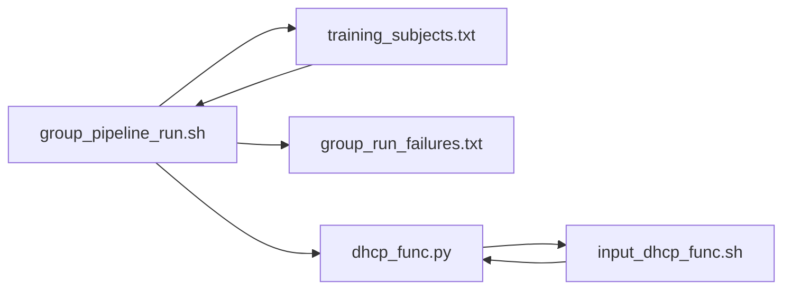
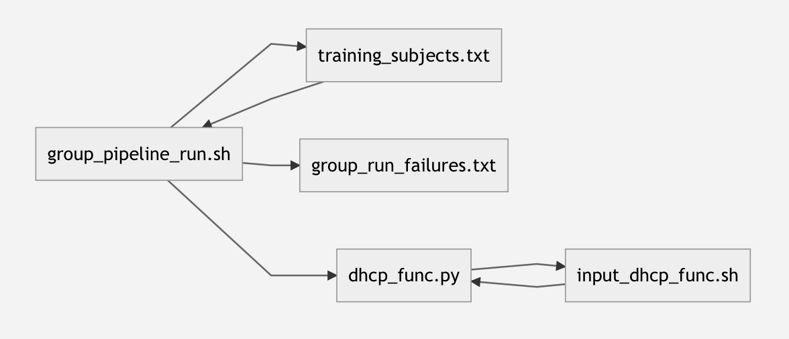

# SickKidsFunc
Formats, converts and preprocessing pipeline for pre-term infants
All relevant code is in `code`. Any code in `old_code` should be considered old.

# File summary
The following will list the scripts Johann Drayne wrote at BCCHR from January-August 2021 and provide details on how to run them/what they do.
There will also be a list describing scripting issues (i.e. parsing a .json file) and the files where these issues are solved with bash or otherwise.

## Name of Files

1. parse_sourcedata_dcm_to_nifti.sh  
2. create_png.sh  
3.  csv_setup_FD.sh  
4.  parse_csv_master.sh  
5.  template_construction.sh
6.  ants_motion_correction.sh
7.  dhcp_anat.sh  
8.  dhcp_func  
9.  training_file.sh
10.  post_smooth_normal.sh  
11.  PSD_png.sh  
12.  welch_and_tissue_mask.sh
13.  group_ICA.sh  
14.  welch_and_gICA_mask.sh
15.  stdfunc_and_tissue_gICA.sh
16.  brain_volume.sh

### 1) parse_sourcedata_dcm_to_nifti.sh
* `PretermCare_list_of_all_series.txt` is parsed to get the file names of all the subjects. 
* The script will check `source data` for these dcm filenames and convert them to nifti in a new folder.
*  It will also output a `failed_dcm_conversions.txt` which documents the filenames from `PretermCare_list_of_all_series.txt` that could not be converted to nifti. 
 
 #### Output folder structure
 The file names can be easily changed to BIDS naming. However, for debugging reasons, it was easiest to keep the original file name (from `sourcedata`). 
 ```
|--v01
|  |--MS040002
|  |  |--t1
|  |  |  |--MS040002_004-T1-Ax-3D-FLASH-1mm-Ortho.nii.gz
|  |  |  |--MS040002_004-T1-Ax-3D-FLASH-1mm-Ortho.json
|  |  |--t2
|  |  |  |--...
|  |  |--gre
|  |  |  |--...
|  |  |--func
|  |  |  |--...
|  |--...
|--v02
```
*Reason for approach:*
* Parsing the .txt file for the subjects names. Source data filenames did not always contain modality information in their filename so I did not know what type of scan the dcm file based off its name.
* Failing dcm info file. Sometimes the file names from the .txt file did not match the file names in the `source data`. 

### 2) create_png.sh  
* Look at files in `${inputDir}` of type `${modality}` and use the FSL function `slicer` to create a folder of .pngs'
 
 #### Output folder structure
 ```
|--v01
|  |--MS040002
|  |  |--MS040002_004-T1-Ax-3D-FLASH-1mm-Ortho.png
|  |  |--...
|  |--...
|--v02
```
*Reason for approach:*
* Using .pngs'. This makes it easier to decide what the best looking scan is. Overlaying the pngs' vs. loading the nifti files into `fsleyes` is much faster.
* New folder for each modality. Having subfolder for each modality keeps all the files for each subject in one place, however, when going through the scans, I found it easier to go through each modality separately. 


### 3) csv_setup_FD.sh  
* Look at files in `${inputDir}` and set up a study .csv
* If there is a `func` file, the FD is calculated using `/home/aweber/Scripts/Misc/FD.r` and added  to the .csv
* The length of the scan in seconds will also be added.

 #### .csv  structure
 ```
Subject ID | AGE | Birth age | Scan Age | FD | Func Length(s) | T1 | t1 Image comment | t1 1=don't use | T2 | t2 Image comment | t2 1=don't use | gre |
```


### 4) parse_csv_master.sh
* Master parser for study .csv
* When called, this script will return the specified variable for the specific subject. 
* If you want this master to parse a different file, change ${FILE} variable.

 #### How to call this script to get a subjects variable

`listage=$(bash ${highDir}code/parse-csv-function.sh scanage${age})`
`listsubject=$(bash ${highDir}code/parse-csv-function.sh subject${age})`

`count=1`
`for i in ${listsubject[@]}; do`
`if [[ ${i} == ${subjectid} ]]; then`
`agescan=$(echo ${listage} | cut -d " " -f ${count})`
`fi`
`count=$((count+1))`
`done` 


*Reason for approach:*
* Script for parsing. It is relatively easy to call to get a subjects variable in other scripts. 
*  It is easy to update the script, so that you can parse new variables if needed in the future.

 
### 5) template_construction.sh

* Take subjects from `${inputDir}` based on the file names in the subject .csv and create a template from their `${age}` and `${modality`
* Will exclude scans based on the .csv inputs `t1 1=don't use` or `t2 1=don't use` if `${exclude}==1`.
* If the template image is getting cropped weirdly, it is recommended to choose a reference image.  
* Will output ${templateFail} which documents the files that were meant to be included in the template construction, but the filename did not match the .csv file name.
* **MORE INFO** on template construction parameters. Visit [WeberLab/MRI Software/ANTs](http://weberlab.wikidot.com/ants#toc8)


*Reason for approach:*
* I found using the reference image to have the highest impact with a  difficult template construction.
* Automatically padding the images to have all the same dimensions did not seem to help with difficult template constructions. 


### 6) ants_motion_correction.sh
* Take subjects from `${inputDir}` based on the file names in the subject .csv
* Will exclude scans (if `${exclude}==1`) based on the .csv inputs if the func `length`  of scan is less than `${datapoints}`.
* This script does **not** do full motion correction.
	* Creates average func image
	* Registers each volume to this average
	* Re-creates average image from this new image
	* Re-registers each volume to this 'stable' average.
* Outputs `motioncorrectedfmri_fail.txt` with subjects that should have been included but failed. 

*Reason for approach:*
* I use this script on all the functional inputs for the `dhcp_func` script. This way the functional pipeline has less 'work' to do.

### 7)   dhcp_anat.sh  
* Take subjects from `${inputDir}` based on the file names in the subject .csv
* Will exclude scans based on the .csv inputs `t1 1=don't use` or `t2 1=don't use` if `${exclude}==1`.
* N4 correction on T1 and T2 files
* Registers T1 to T2 space
* Runs dHCP anatomical pipeline
* Output is in `${curDir}` which is under `${HOME}` directory
* Run a single subject run, or on all subjects by commenting out `if  [[  ${i}  ==  ${subjectid}  ]];  then` and bottom `fi` 
* **MORE INFO** on dHCP output structure. Visit [WeberLab/MRI Methods/Skull Strip](http://weberlab.wikidot.com/brain-segmentation-skull-stripping#toc2)


*Reason for approach:*
* Temporary directory `${tempDir}` to store intermediate files: I thought this would be a clean way to get rid of any intermediate files.
* Output in `${HOME}`: I could not get the Docker image to run in the `/mnt` directory as a standard `${USER}` so will have to `cp -r` the output folder into `/mnt` 


### 8)   dhcp_func 

1. `group_pipeline_run.sh`  ------ master script to run subjects
2. `training_subjects.txt`--------- subjects to run pipeline on 
3. `dhcp_func.py` -----------------pipeline from dHCP
4. `input_dhcp_func.sh`  ----------script to create inputs
5. `group_run_failures.txt`  -------output failed subjects
6. `eddy.sh`  ------------------------test run eddy separately

#### What exactly do these scripts do




1) `group_pipeline_run.sh` is the main script which you use if you want to run on all the subjects
2) `training_subjects.txt` only stores the subjects that you want to run the script on. e.g.`v01,MS040002` Where every new line contains a different subject.
3) `dhcp_func.py` is called by `group_pipeline_run.sh`. This script contains all the 'dHCP code'. If you want to want a `mcflirt` version of the script or only run each subject to a certain point. This is the script which you will edit.
4) `input_dhcp_func.sh` is called by `dhcp_func.py`. It takes the given subject and age and creates a file containing all the input information for `dhcp_func.py`.
5) `group_run_failures.txt` is edited by `group_pipeline_run.sh` where it check if the `qc` is created after `dhcp_func.py` has been run. If it has not been created then we assume the pipeline failed and the particular subject should be added to this .txt file.
6) `eddy.sh` Is just a tester file, where you can play about with eddy parameters to try and get a better motion correction.


* To run the dHCP fuctional pipeline you will need to `cp -r` this directory into `${HOME}` e.g. `cp -r dhcp_func ${HOME}`
* If the pipeline is not installed, follow the steps in `${dhcp_func_install}`

* **MORE INFO** I asked many questions on [Neurostars forum](https://neurostars.org/t/dhcp-fmri-without-sbref-or-fieldmap/19150) which may be helpful/insightful.


*Reason for approach:*
* Many scripts: The number of scripts can be confusing. But it made sense when de-bugging to split the main steps of running this pipeline up.

### 9).  training_file.sh
* Looks at subjects in `${dhcpDir}` and sets up the FIX folder to create the training file.
* It is assumed that `${dhcpDir}`  only creates subjects you want to create the training file from and that you have already manually classified the IC maps as being signal or noise. 


### 10).  post_smooth_normal.sh

* **based off** [dHCP post process.py](https://git.fmrib.ox.ac.uk/seanf/dhcp-neonatal-fmri-pipeline/-/blob/master/dhcp/func/postprocess.py)
* Takes cleaned and denoised func images (in func space) from the `dhcp_func` output, path is at `dhcpDir`.
* Transform the func image (in func space) to the 40w old template. 
* Applies a smoothing kernel of `fwhm` we found 8 was best for the neonates. 
* Applies a FEAT-style grand mean intensity normalisation to the value of `${normmean}`, we used 10000.
* Re-sample the func images to the func mean (in template space) provided.


*Reason for approach:*
* The template which all images are registered to can be specified in the 'dhcp_func' pipeline ... 40w old was default, so we stuck with it. 
* Reason for order of steps
	* Smooth -> Normalise -> Resample (8 mins)
	*  Resample -> Smooth -> Normalise (12 hours)
	* Similar results if resampling is after smoothing and normalising and the the time taken is significantly reduced.
* Script only runs on one 'age'. To speed things up you can duplicate the script and run it on the other ages on a different computer. 


### 11).  PSD_png.sh 
* Although, not necessary, it is advisable to run this script to check Power Spectrum Densities of the cortical grey matter.
* Takes inputs from `welch_and_tissue_mask.sh` outputs. 
* Change `${fwhm}` to use the images that have had this smoothing kernel applied.
* Uses `PSD.py` to create the PSD and stores the image as a .png in `PSD_png_FWHM_${fwhm}` to be easily checked.


### 12).  welch_and_tissue_mask.sh
* Takes segmented `t2` from the `dhcp_func` output and separates each tissue.
* Transforms each tissue to template space using the transforms output from `dhcp_func`
* Binarise and resample each tissue to be in the same space as the `func` (in template space).
* Takes inputs from `post_smooth_normal.sh` outputs. 
* Runs `welch.py` on the func images.
* Mask the `welch_func` images with each tissue mask.
* Create a .csv (`mean_welch_in_tissues_FWHM_${fwhm}.csv`) and write the mean and standard deviation of the H value in each mask.

*Reason for order of steps*
* Order for creating maps
	1) Separate tissues -> Transform
	2) Transform -> Segment

* I found that 1. worked best. If I transformed before segmenting the tissue values varied significantly it was non-trivial to automatically separate each of these maps for any subject.

* Creates mutually exclusive tissue maps. When transforming the tissues to template space, their maps overlapped even after thresholding. So any overlap from the two images was removed from both of them. **NOTE:** This was only done on the between the cortical grey matter and white matter. 


### 13).  group_ICA.sh  
* Takes inputs from `post_smooth_normal.sh` outputs (from the specific `${fwhm}` kernal).
* Create a subject .txt file from the above inputs
* Run group ICA with `${refMask}` as a mask
* Output in `${outDir}`


### 14).  welch_and_gICA_mask.sh
* Manually look at output from `group_ICA.sh ` and note the indexes of maps that are networks. Also not what network they are. 
* Change the values in `${networks}` to keep the maps that correspond to networks
* If needed, you can add two network together. In my case I needed to add network 9 and 13 together
* Manually type in the name of each network corresponding to the number of network. You will need to update.
	* .csv headers
	* block starting with `# binary masks equal to each network`
* The script will binarise the networks and mask the H_brain output from `${welchDir}`.
* It will then output the mean and standard deviation of the H value in each network, for each subject in `${info file}` 

### 15).  stdfunc_and_tissue_gICA.sh
* There are 3 blocks of code which can be commented out if `welch_and_gICA_mask.sh` has been run previously. They are.
	* `# split up melodic file in ${ICAdir} to separate out networks`
	* `# binarise masks based on above networks array`
	* `# add masks together`
* Specify the `${fwhm}` to look at the maps and networks.
* This script will mask the cleaned functional image and find the standard deviation in each voxels time series.
* It will then save the mean standard deviation of the voxels in each network in `${infofile}`.

### 16).  brain_volume.sh
* Looks at the skull stripped outputs from the dHCP anatomical pipeline.
* Using `fslstats ${t2} -V` to find the volume. 
* The script simply echos the value onto the terminal to be added to a .csv 

> Written with [StackEdit](https://stackedit.io/).
